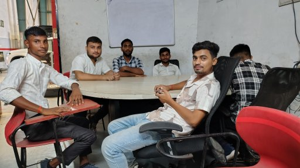

<!DOCTYPE html>
<html lang="hi">
<head>
    <meta charset="UTF-8">
    <meta name="viewport" content="width=device-width, initial-scale=1.0">
    <title>Guru App</title>

    
</head>

<body>

    <h1>Welcome to Guru App</h1>

    
मेरा नाम <b>गुरु जायसवाल</b> है।

    

        मैं HTML सीख रहा हूँ।
    

    <h2>My Images</h2>

    
    
    
    
    

    <h3>SATYAM JAISWAL</h3>

    

        आज मैंने Title का Color बदलना सीख लिया है।
    

    <a href="https://www.youtube.com/results?search_query=guru+to+mach" target="_blank">
        YouTube Search
    </a>

    <a href="guru7.html">
        Open AB Page
    </a>

    <a href="https://www.youtube.com/@SatyamJaiswal-q4k" target="_blank">
        Subscribe
          
        
    </a>

    <h2>Student Result</h2>

    <table>
        <tr>
            <th>Name</th>
            <th>Father Name</th>
            <th>Result</th>
        </tr>

        <tr>
            <td>Satyam</td>
            <td>Jaiswal</td>
            <td>Pass</td>
        </tr>

        <tr>
            <td>Guru</td>
            <td>Jaiswal</td>
            <td>Pass</td>
        </tr>

        <tr>
            <td>Rahul</td>
            <td>Kumar</td>
            <td class="fail">Fail</td>
        </tr>
    </table>
      <a href="AB.html">
        Open QR Page
    </a

</body>
</html>
